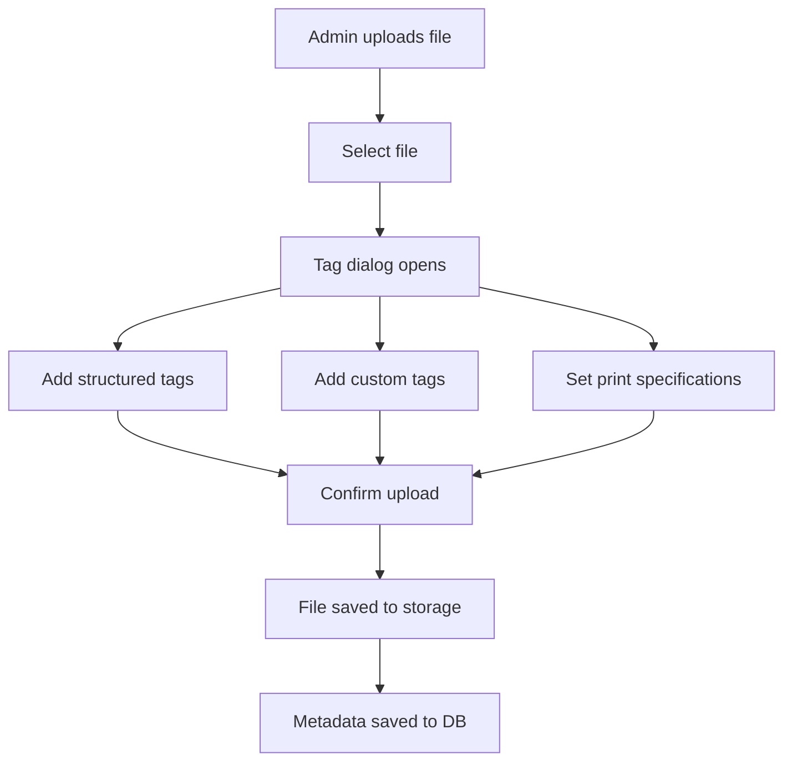
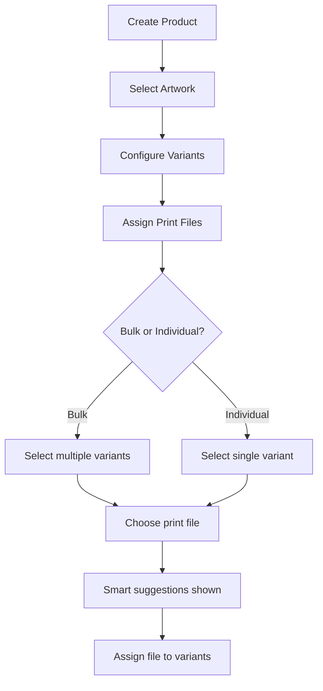
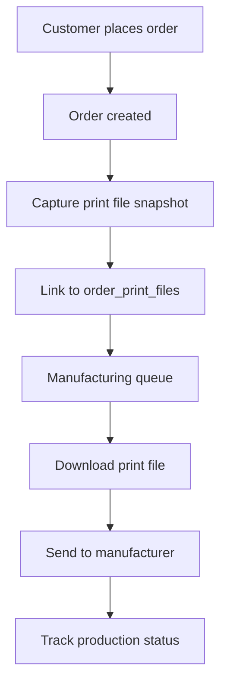
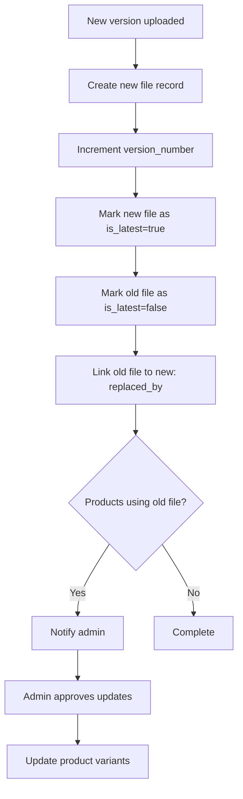

# File Management & Tagging System

## Overview

The File Management System provides a comprehensive solution for managing artwork files, print specifications, and variant assignments. It includes intelligent tagging, versioning, bulk operations, and smart suggestions to streamline the production workflow.

## Core Concepts

### File Types
- **Original**: High-resolution source files from partners
- **Print Ready**: Files prepared for specific print specifications
- **Thumbnail**: Preview images for web display
- **Mockup**: Product visualization files
- **Reference**: Additional reference materials

### Tag System

#### Structured Tags
Predefined categories for consistent organization:

**Size Tags**
- 4x6, 5x7, 8x10, 11x14, 16x20, 18x24, 24x36

**Color Profiles**
- sRGB (web standard)
- CMYK (print standard)
- Adobe RGB (extended gamut)
- ProPhoto RGB (wide gamut)

**Print Methods**
- Giclée (high-quality inkjet)
- Offset Lithography (commercial printing)
- Screen Print (traditional)
- Digital Print (standard)
- Dye Sublimation (heat transfer)

**Resolution**
- 72 DPI (screen)
- 150 DPI (draft print)
- 300 DPI (standard print)
- 600 DPI (high quality)

**Material**
- Canvas, Paper, Metal, Wood, Fabric

#### Custom Tags
Freeform tags for specific needs:
- `canvas-ready`
- `archival-ink`
- `matte-finish`
- `glossy-finish`

#### Variant Matching
Tags can be linked to variant codes for automatic suggestions:
```json
{
  "matches_variants": {
    "size_codes": ["03", "04"],
    "color_codes": ["BK", "WH"]
  }
}
```

### Print Specifications

Each file can have detailed print specifications:

**Dimensions**: Physical print size (e.g., "16\" × 20\"")
**DPI/Resolution**: Print quality (72, 150, 300, 600)
**Color Profile**: Color space management
**Color Space**: RGB, CMYK, etc.
**Bleed**: Extra print area (e.g., "0.125\"")
**Safe Zone**: Protected content area (e.g., "0.25\"")
**Notes**: Special printing instructions

## Workflows

### 1. File Upload Workflow



**Steps:**
1. Admin navigates to Artwork Detail page
2. Clicks "Files" tab
3. Drags/drops file or clicks to browse
4. Tag selector dialog opens
5. Admin selects relevant tags:
   - Size: "16x20"
   - Color Profile: "CMYK"
   - Print Method: "giclée"
   - Resolution: "300dpi"
   - Custom: "canvas-ready", "archival-ink"
6. Admin adds print specifications
7. Admin confirms upload
8. File uploaded to storage and metadata saved

### 2. Product Creation Workflow



**Steps:**
1. Admin creates a new Product from an Artwork
2. System loads all available print files
3. For each variant (or group of variants):
   - Open Print File Selector
   - View smart suggestions ranked by match score
   - Select appropriate print file
4. Bulk assignment option available for multiple variants at once

### 3. Order Fulfillment Workflow



**Features:**
- Print file is locked to specific version at order time
- File snapshot preserved even if original is updated
- Manufacturing status tracking
- File delivery to manufacturer

### 4. File Versioning Workflow



**Version History:**
- Each file has a `version_number`
- Only latest version has `is_latest = true`
- Previous versions linked via `replaced_by` field
- Products using old versions can be identified
- Approval workflow for bulk updates

## Smart Suggestions Algorithm

The system ranks print files based on multiple factors:

### Match Score Calculation
```
Base Score = 0

+10 points: File is marked as primary for artwork
+5 points:  File is latest version
+20 points: For each matching variant code in tags.matches_variants
```

### Example Scenario

**Product Variant:** Canvas Print, 16x20, Black Frame
**Variant Code:** `10A001-CN-03-BK`

**Available Print Files:**
1. `artwork_v2.tif`
   - Tags: size:"16x20", material:"canvas", color_profile:"CMYK"
   - matches_variants: { size_codes: ["03"] }
   - is_primary: true
   - is_latest: true
   - **Score: 35** (10+5+20)

2. `artwork_v1.tif`
   - Tags: size:"16x20", material:"canvas"
   - is_primary: false
   - is_latest: false
   - **Score: 0**

3. `artwork_print_8x10.tif`
   - Tags: size:"8x10"
   - is_primary: false
   - is_latest: true
   - **Score: 5**

**Result:** File 1 is suggested first with detailed match reasons.

## Database Schema

### artwork_files Table
```sql
CREATE TABLE artwork_files (
  id UUID PRIMARY KEY,
  artwork_id UUID REFERENCES artworks(id),
  file_name TEXT NOT NULL,
  file_path TEXT NOT NULL,
  file_type TEXT NOT NULL,
  file_size BIGINT,
  mime_type TEXT,
  is_primary BOOLEAN DEFAULT false,
  
  -- NEW: File management columns
  tags JSONB DEFAULT '{"structured": {}, "custom": [], "matches_variants": {}}'::jsonb,
  version_number INTEGER DEFAULT 1,
  is_latest BOOLEAN DEFAULT true,
  replaced_by UUID REFERENCES artwork_files(id),
  print_specifications JSONB DEFAULT '{}'::jsonb,
  
  -- Metadata
  uploaded_at TIMESTAMPTZ DEFAULT now(),
  uploaded_by UUID
);
```

### file_tags Table (Reference)
```sql
CREATE TABLE file_tags (
  id UUID PRIMARY KEY,
  category TEXT NOT NULL,        -- 'size', 'color_profile', etc.
  tag_value TEXT NOT NULL,       -- '16x20', 'CMYK', etc.
  display_name TEXT NOT NULL,    -- User-friendly name
  description TEXT,
  sort_order INTEGER DEFAULT 0,
  is_active BOOLEAN DEFAULT true
);
```

### product_variants Table (Updated)
```sql
ALTER TABLE product_variants
ADD COLUMN print_file_id UUID REFERENCES artwork_files(id),
ADD COLUMN print_specifications JSONB DEFAULT '{}'::jsonb;
```

### order_print_files Table (New)
```sql
CREATE TABLE order_print_files (
  id UUID PRIMARY KEY,
  order_id UUID NOT NULL,
  product_variant_id UUID REFERENCES product_variants(id),
  print_file_id UUID REFERENCES artwork_files(id),
  
  -- Immutable snapshot
  file_snapshot JSONB NOT NULL,
  file_version_number INTEGER NOT NULL,
  
  -- Manufacturing tracking
  sent_to_manufacturer_at TIMESTAMPTZ,
  manufacturer_id UUID,
  manufacturing_status TEXT DEFAULT 'pending',
  
  -- Specifications
  print_specifications JSONB
);
```

## UI Components

### FileTagSelector
**Location:** `src/components/artworks/FileTagSelector.tsx`
**Purpose:** Interactive tag selection with structured + custom tags
**Features:**
- Checkbox selection for structured tags
- Custom tag input field
- Visual tag badges
- Category grouping

### PrintFileSpecifications
**Location:** `src/components/artworks/PrintFileSpecifications.tsx`
**Purpose:** Print specification form
**Features:**
- Dimensions input
- DPI selector
- Color profile selector
- Bleed and safe zone inputs
- Additional notes

### ArtworkFileUpload
**Location:** `src/components/artworks/ArtworkFileUpload.tsx`
**Purpose:** Enhanced file upload with tagging
**Features:**
- Drag and drop upload
- Tag dialog on upload
- File version display
- Primary file marking
- Tag count badges

### PrintFileSelector
**Location:** `src/components/artworks/PrintFileSelector.tsx`
**Purpose:** Smart print file selection for products
**Features:**
- Ranked file suggestions
- Match score display
- Match reason explanations
- Tag preview
- File preview

### BulkPrintFileAssignment
**Location:** `src/components/artworks/BulkPrintFileAssignment.tsx`
**Purpose:** Shopify-style bulk assignment
**Features:**
- Multi-select variants
- Select all/deselect all
- Filtered print file list
- Visual assignment confirmation
- Assignment summary

## API Functions

### get_print_file_suggestions()
**Purpose:** Returns ranked list of print files for a variant
**Parameters:**
- `p_artwork_id`: UUID of artwork
- `p_variant_codes`: Array of variant code segments

**Returns:**
```typescript
{
  file_id: UUID,
  file_name: string,
  tags: JSONB,
  match_score: number,
  match_reasons: string[]
}[]
```

### create_file_version()
**Purpose:** Creates a new version of an existing file
**Parameters:**
- `p_original_file_id`: UUID of file to version
- `p_new_file_data`: JSONB with new file info

**Returns:** UUID of new file version

**Process:**
1. Increments version number
2. Marks old file as `is_latest=false`
3. Creates new file record
4. Links old file via `replaced_by`

## Best Practices

### Tagging Strategy
1. **Always tag by size** - Critical for variant matching
2. **Use color profiles consistently** - CMYK for print, sRGB for web
3. **Tag print methods** - Helps filter files by production capability
4. **Add custom tags for special cases** - Material-specific or finish-specific needs
5. **Link to variant codes** - Enable smart suggestions

### File Organization
1. **Primary file per artwork** - One designated default file
2. **Multiple versions for different uses** - Don't overwrite, version instead
3. **Clear naming conventions** - Include size, version, date in filename
4. **Descriptive print specifications** - Document all printing requirements

### Variant Assignment
1. **Use bulk assignment for similar variants** - Save time on large products
2. **Review smart suggestions** - System ranks best matches first
3. **Document variant-specific needs** - Use print_specifications override
4. **Update in batches** - When new files arrive, bulk update affected products

## Future Enhancements

### Phase 2 Features
- [ ] Automatic thumbnail generation
- [ ] Image optimization for web
- [ ] Color space conversion tools
- [ ] File validation (dimensions, DPI, color profile)
- [ ] Batch file upload
- [ ] Template-based print specifications

### Phase 3 Features
- [ ] Integration with print manufacturers
- [ ] Automated file delivery
- [ ] Real-time print status updates
- [ ] Quality control checklists
- [ ] File preview and comparison tools

### Phase 4 Features
- [ ] AI-powered file suggestions
- [ ] Automatic print file generation
- [ ] Print cost estimation
- [ ] Production time forecasting
- [ ] Supplier performance analytics

## Troubleshooting

### Common Issues

**Q: Print file suggestions not showing?**
A: Ensure files are tagged with relevant variant codes in `matches_variants`

**Q: Bulk assignment not working?**
A: Check that variants have valid `variant_code` values

**Q: Version history broken?**
A: Use `create_file_version()` function instead of manual updates

**Q: Manufacturing queue empty?**
A: Verify `order_print_files` records are created during checkout

**Q: File not showing in product?**
A: Check `is_latest=true` and file_type='original'

## Support

For questions or issues:
- Review this documentation
- Check database functions in `supabase/migrations/`
- Review component source code
- Test with sample artwork and products
